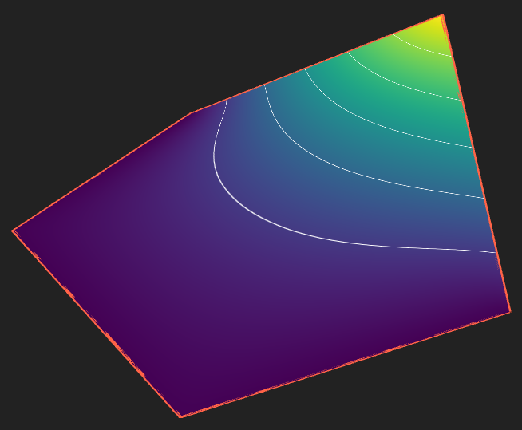

# Generalized Barycentric Coordinates Tool

This 3D web tool allows the manipulation of a polygon and can show several generalized barycentric coordinates functions applied to it, including Wachspress and mean value coordinates. The functions and other mathematics behind it are discussed in detail in [1].

The tool is developed by Bob van der Vuurst and supervised by Jiri Kosinka for the 'Short Programming Project' course at the University of Groningen (RUG). Jiri Kosinka is the head of the [Scientific Visualization and Computer Graphics (SVCG) research group](https://www.cs.rug.nl/svcg/) at RUG and also an author of [1].

## Documentation
For an overview of the provided functionalities and documentation, please check the project report, which can be found [here](documentation/GeneralizedBarycentricCoordinates.pdf).

## Deployments
The tool is deployed on Github Pages, which can be found [here](https://bob-vdv.github.io/BarycentricCoordinates/). 

The tool will also be deployed on the [web tools section of the SVCG website](https://svcg.web.rug.nl/).

## References
[1] 
Kosinka, J., & Barton, M. (2016). Convergence of barycentric coordinates to barycentric kernels. Computer aided geometric design, 43, 200-210. https://doi.org/10.1016/j.cagd.2016.02.003
URL: https://research.rug.nl/en/publications/convergence-of-barycentric-coordinates-to-barycentric-kernels
